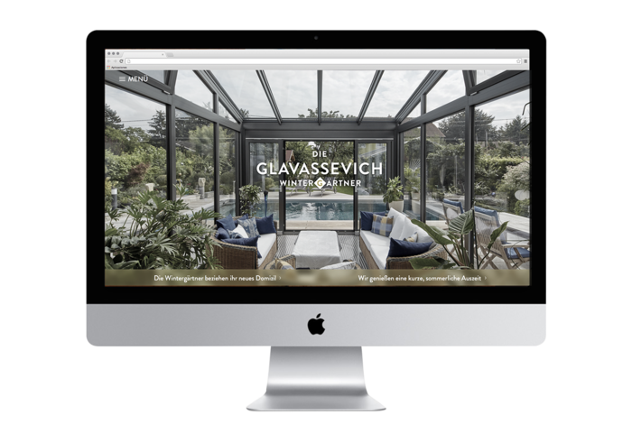

In 2015 <a href="http://www.lukaskollmann.at" target="_blank">Lukas Kollmann</a> and I were asked to be part of a huge redesign of a local wintergarden-construction company named <a href="http://www.wintergaertner.at" target="_blank">Glavassevich</a> which was done by <a href="http://ipu.at" target="_blank">I-Punkt</a> and <a href="http://cargocollective.com/nebulabor/" target="_blank">Nebulabor</a>. Our part was to redesign their whole digital identity. Our findings and design would then be incorporated into the corporate identity and vice versa.

### The Brand

The main goal for the new website was, to attract clients and make it easy for them to contact the company. We accomplished that by making very minimal contact-forms and clear Call-To-Action Elements throughout the site.

Conceptually the new site works on two separate layers. One would be a showcase of their current projects and another would be background info on how they are working and some tips if you are planning to have a wintergarden built for you.

### Images

Biggest design element were the huge architectural images of their current projects. We tried to use them whereever possible to evoke an immediate emotional response from the user.

Combine these larges images with clever copy and you get an effective Call-To-Action right at the beginning of every page.

### The Contest

A bonus feature of the site is a sort of contest for the users. If they find 20 of the hidden Glavassevich-Logos throught the showcase they will be prompted with a form to participate for a big prize. With some clever use of Cookies and SessionStorage we were able to pull this feature off in a way that it can be reused whenever the client wants to have a contest. 

### Development

The whole site is based on a custom Wordpress-Theme which makes it wildly extendable by nature. Future Feature requests can be implemented in a timely manner. With Wordpress as a CMS the client can also easily manage almost every tiny bit of the website. Our focus was to make it very simple for the client to maintain their content on the website as well as to provide a sleek and usable frontend for the visitors of the site.

Together with <a href="http://wukonig.com" target="_blank">SEO-Expert J&#xF6;rg Wukonig</a> we set up some Goals in Google Analytics to gather some data on how the site is used. For the future we are ready to react on our users behaviour accordingly.

All in all it was a really big project with lots of tiny facets to think of. We&apos;re really happy with the results so far and it starts to reflect on the data as well. The redesign of Glavassevich was one of the biggest projects I&apos;ve been part of and I&apos;m happy that I took on this challenge.

<a href="http://www.wintergaertner.at" target="_blank">Check out the website</a> and let me know what you think!

